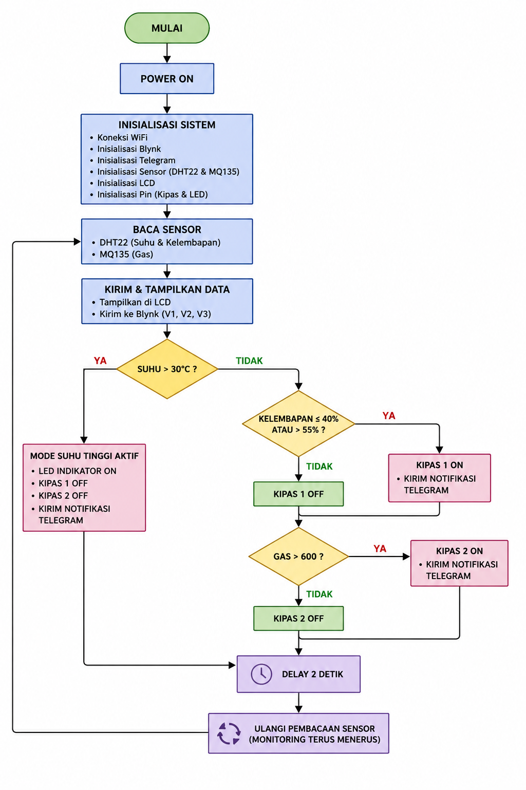
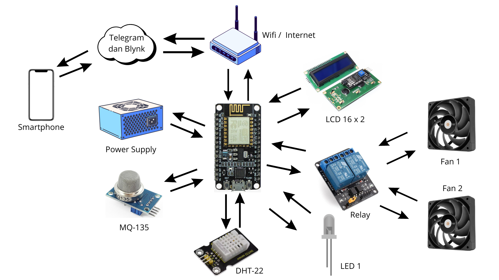
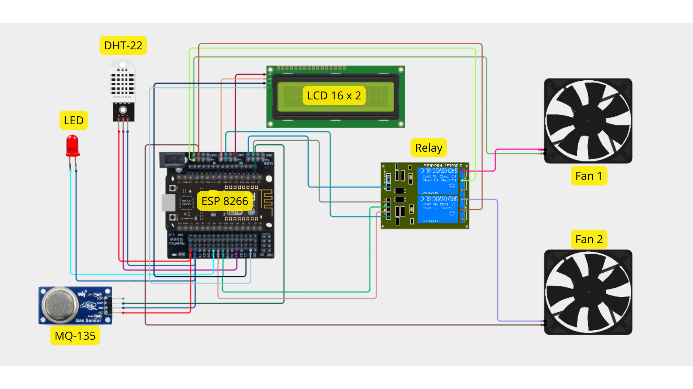
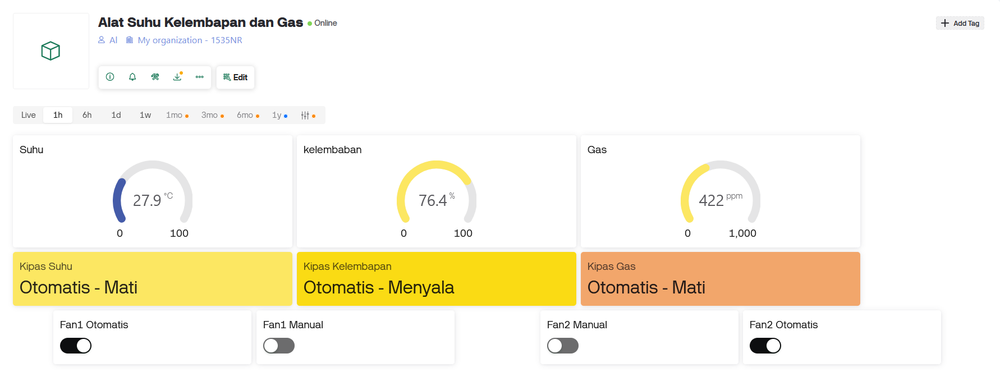
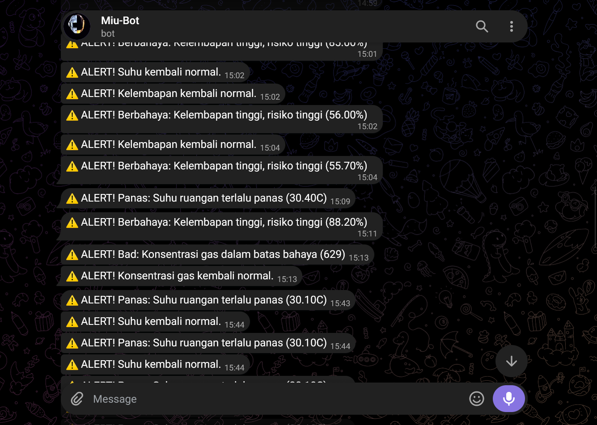
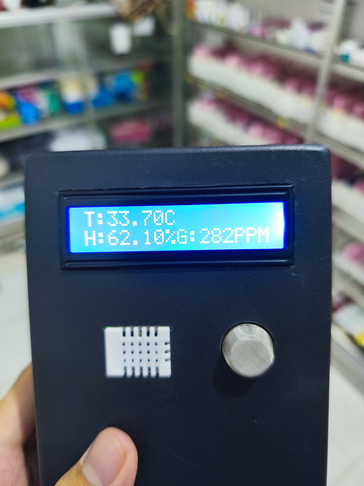
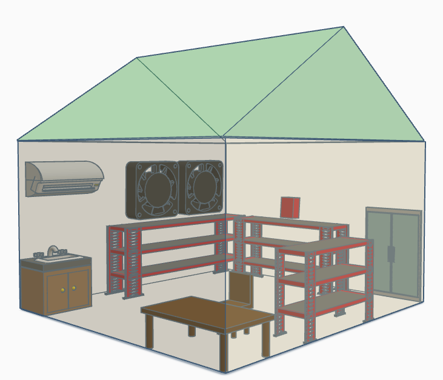

# 🌡️ IoT Room Monitoring System

IoT-based room monitoring system for temperature, humidity, and gas detection using ESP8266, DHT22, MQ135, Blynk, and Telegram notifications.

---

## 📖 Overview

This project was developed to monitor room environmental conditions in real time. The system measures temperature, humidity, and gas concentration using IoT technology and automatically provides alerts when unsafe conditions are detected.

The monitoring data can be viewed through an LCD display and Blynk dashboard, while Telegram notifications are sent automatically when abnormal conditions occur.

---

## 🛠 Hardware Components

* NodeMCU ESP8266
* DHT22 Temperature & Humidity Sensor
* MQ135 Gas Sensor
* LCD I2C 16x2
* Relay Module
* Cooling Fans
* LED Indicator
* Power Supply

---

## 💻 Software & Tools

* Arduino IDE
* ESP8266 Board Package
* Blynk IoT Platform
* Telegram Bot API
* C++

---

## ✨ Features

* Real-time temperature monitoring
* Real-time humidity monitoring
* Real-time gas concentration monitoring
* LCD display monitoring
* Blynk dashboard integration
* Telegram alert notifications
* Automatic fan control
* Environmental condition evaluation
* IoT remote monitoring

---

## 📊 System Workflow

1. ESP8266 initializes all sensors and modules.
2. DHT22 reads temperature and humidity values.
3. MQ135 reads gas concentration values.
4. Data is displayed on LCD.
5. Data is sent to the Blynk dashboard.
6. System evaluates environmental conditions.
7. Fans and indicators are controlled automatically.
8. Telegram alerts are sent when dangerous conditions are detected.
9. Monitoring process runs continuously.

---

# 📂 Project Structure

```text
IoT-Room-Monitoring-System/
│
├── Arduino/
│   └── iot_room_monitoring.ino
│
├── Diagram/
│   ├── flowchart_sistem.png
│   ├── block_diagram.png
│   └── wiring_diagram.png
│
├── Screenshot/
│   ├── dashboard_blynk.png
│   ├── notifikasi_telegram.png
│   ├── lcd_display.jpg
│   └── prototype_alat.jpg
│
└── README.md
```

---

# 🔄 Flowchart System



---

# 🧩 Block Diagram



---

# 🔌 Wiring Diagram



---

# 📱 Dashboard Monitoring



---

# 🔔 Telegram Notification



---

# 📟 LCD Display



---

# 🏗️ Prototype Device



---

# 📈 Monitoring Parameters

| Parameter         | Safe Range  |
| ----------------- | ----------- |
| Temperature       | 25°C - 30°C |
| Humidity          | 40% - 55%   |
| Gas Concentration | < 600 ppm   |

---

# 🎯 Objectives

* Monitor room environmental conditions in real time.
* Improve monitoring efficiency using IoT technology.
* Provide early warning notifications for abnormal conditions.
* Support safer storage environments through automated monitoring.

---

# 👨‍💻 Author

**Aldo Raditya Pangestu**

Computer Systems Graduate | IoT Developer | Embedded Systems Enthusiast

Technologies:

* ESP8266
* ESP32
* Arduino IDE
* Blynk
* Telegram Bot
* C++
* IoT Systems

---

⭐ If you find this project useful, feel free to give it a star.
